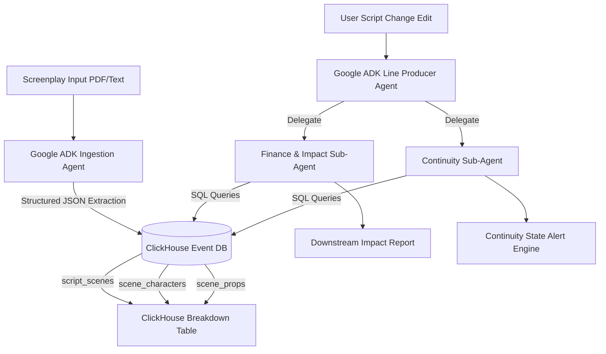

# 📐 Technical Design Document: DIRECTOR'S CUT

**System Name:** DIRECTOR'S CUT (The Autonomous Hollywood Operations Agent)  
**Tagline:** *A screenplay isn't a document. It's a database.*  
**Primary Framework:** Google ADK (Agent Development Kit - Python)  
**Primary Data Engine:** ClickHouse Cloud  

---

## 1. System Architecture Diagram



---

## 2. Google ADK Agent Specifications

### Line Producer Agent (Root Orchestrator)
- **Role**: Manages application state, routes user inputs, coordinates breakdown ingestion, diffs script edits, and aggregates responses from sub-agents.
- **Model**: `gemini-1.5-pro` (Vertex AI / Gemini API).

### Ingestion Breakdown Agent (Use Case 1)
- **Role**: Parses unstructured screenplay text into structured relational event entities (Scenes, Locations, Character Wardrobe, Prop States).
- **Tool**: `ClickHouseInsertTool` — Writes JSON entities directly into ClickHouse MergeTree tables.

### Impact Analysis Agent (Use Case 2)
- **Role**: Analyzes script modifications (e.g. location changes, scene removals, scene additions).
- **Tool**: `ClickHouseQueryTool` — Executes aggregation queries against `script_scenes` to calculate cost deltas, day/night lighting shifts, and location permit impacts.

### Continuity Management Agent (Use Case 3)
- **Role**: Tracks physical prop state transitions and character presence across scene timelines.
- **Tool**: `ClickHouseQueryTool` — Runs window & state queries to verify prop ownership before/after scenes.

---

## 3. ClickHouse Database Schema & Indexing

```sql
-- Database: directors_cut_db

CREATE TABLE IF NOT EXISTS script_scenes (
    scene_id String,
    scene_number UInt32,
    location String,
    time_of_day String,
    description String,
    cost_estimate Float64,
    created_at DateTime DEFAULT now()
) ENGINE = MergeTree()
ORDER BY (scene_number);

CREATE TABLE IF NOT EXISTS scene_characters (
    scene_number UInt32,
    character_name String,
    wardrobe String,
    status String
) ENGINE = MergeTree()
ORDER BY (scene_number, character_name);

CREATE TABLE IF NOT EXISTS scene_props (
    scene_number UInt32,
    prop_name String,
    prop_state String,
    character_holding String
) ENGINE = MergeTree()
ORDER BY (scene_number, prop_name);
```

---

## 4. Query Performance & Benchmarks

| Operation | Query Pattern | Expected ClickHouse Latency |
| :--- | :--- | :--- |
| **Full Breakdown Query** | `SELECT * FROM script_scenes ORDER BY scene_number` | `< 5ms` |
| **Location Impact Delta** | `SELECT count(*), sum(cost_estimate) FROM script_scenes WHERE location = ?` | `< 3ms` |
| **Prop Continuity Check** | `SELECT prop_state FROM scene_props WHERE scene_number < ? AND prop_name = ? ORDER BY scene_number DESC LIMIT 1` | `< 2ms` |
